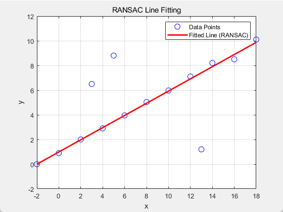
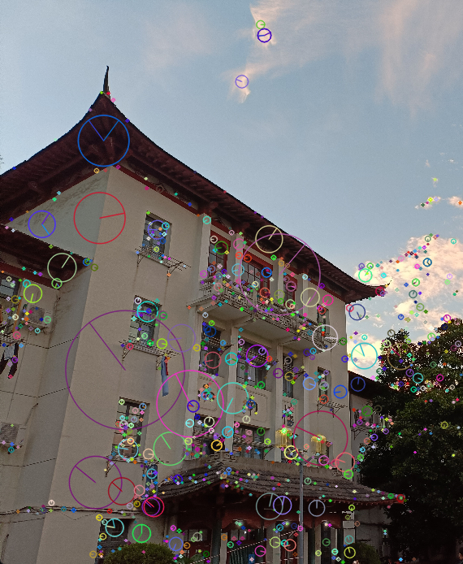
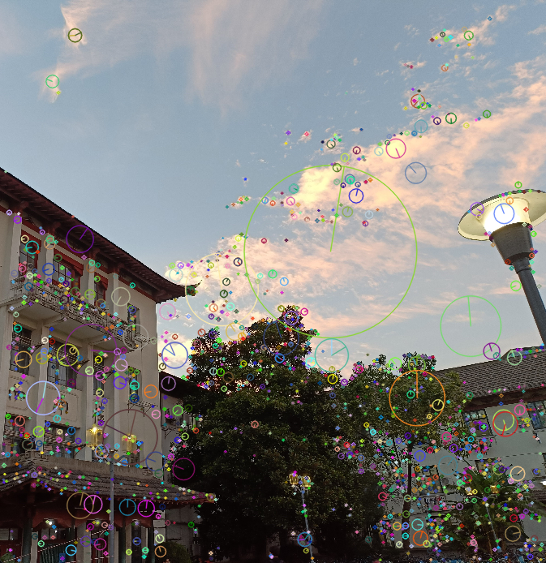
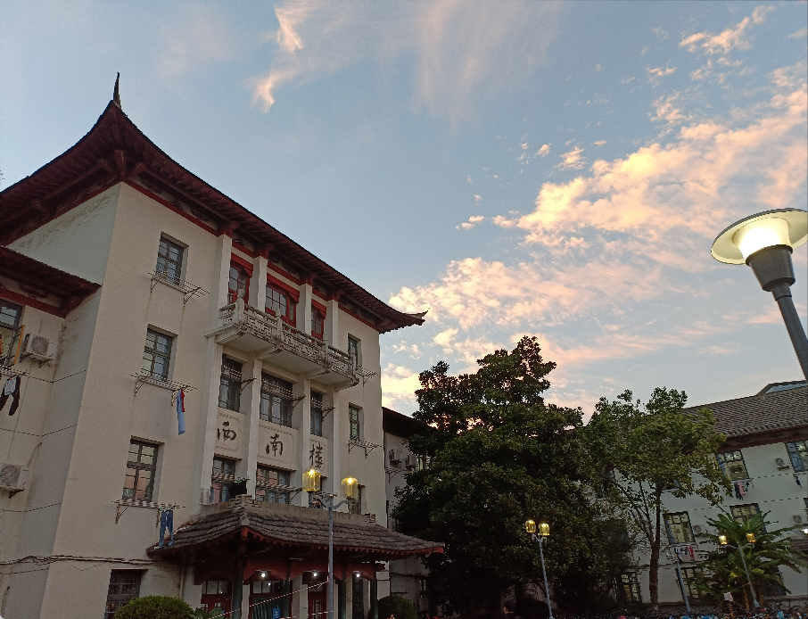

# Assignment 1

## Question 1

To prove that the set $\{M_i\}$ forms a group, we need to show that it satisfies the four properties of a group: **closure**, **associativity**, **existence of an identity element**, and **existence of an inverse element**. The steps are detailed below:

### 1. Closure

Closure requires that for any two matrices $M_i$ and $M_j$, their product $M_i M_j$ must also belong to the set $\{M_i\}$.

Assume $M_i$ and $M_j$ are of the form:
$$
M_i = \begin{bmatrix} R_i & t_i \\ 0^T & 1 \end{bmatrix}, \quad
M_j = \begin{bmatrix} R_j & t_j \\ 0^T & 1 \end{bmatrix}
$$

We calculate the product $M_i M_j$:
$$
M_i M_j = \begin{bmatrix} R_i & t_i \\ 0^T & 1 \end{bmatrix} \begin{bmatrix} R_j & t_j \\ 0^T & 1 \end{bmatrix} = \begin{bmatrix} R_i R_j & R_i t_j + t_i \\ 0^T & 1 \end{bmatrix}
$$
It is clear that the resulting matrix retains the same form, where the top-left block is $R_i R_j$.

Since $R_i$ and $R_j$ are orthogonal matrices, we have:
$$
R_i^T R_i = I, \quad R_j^T R_j = I
$$

We need to prove that $R_i R_j$ is also an orthogonal matrix, i.e., $(R_i R_j)^T (R_i R_j) = I$.

First, we calculate $(R_i R_j)^T$:
$$
(R_i R_j)^T = R_j^T R_i^T
$$

Then:
$$
(R_i R_j)^T (R_i R_j) = R_j^T R_i^T R_i R_j
$$
Using the orthogonality properties $R_i^T R_i = I$ and $R_j^T R_j = I$, we get:
$$
R_j^T (R_i^T R_i) R_j = R_j^T I R_j = R_j^T R_j = I
$$

This shows that $(R_i R_j)^T (R_i R_j) = I$, and thus $R_i R_j$ is also orthogonal. The top-right block is $R_i t_j + t_i$ (a vector), and the bottom row remains $[0^T, 1]$. Therefore, the product $M_i M_j$ belongs to the set $\{M_i\}$, proving closure.

### 2. Associativity

Associativity requires that for any three matrices $M_i$, $M_j$, and $M_k$, we have $(M_i M_j) M_k = M_i (M_j M_k)$.

For any three matrices $M_i$, $M_j$, and $M_k$ from $\{M_i\}$:
$$
(M_i \times M_j) \times M_k = \left(\begin{bmatrix} R_i & t_i \\ 0^T & 1 \end{bmatrix} \begin{bmatrix} R_j & t_j \\ 0^T & 1 \end{bmatrix}\right) \begin{bmatrix} R_k & t_k \\ 0^T & 1 \end{bmatrix}
$$
$$
= \begin{bmatrix} R_i R_j & R_i t_j + t_i \\ 0^T & 1 \end{bmatrix} \begin{bmatrix} R_k & t_k \\ 0^T & 1 \end{bmatrix} = \begin{bmatrix} R_i R_j R_k & R_i R_j t_k + R_i t_j + t_i \\ 0^T & 1 \end{bmatrix}
$$
Similarly:
$$
M_i \times (M_j \times M_k) = \begin{bmatrix} R_i & t_i \\ 0^T & 1 \end{bmatrix} \left(\begin{bmatrix} R_j & t_j \\ 0^T & 1 \end{bmatrix} \begin{bmatrix} R_k & t_k \\ 0^T & 1 \end{bmatrix}\right)
$$
$$
= \begin{bmatrix} R_i & t_i \\ 0^T & 1 \end{bmatrix} \begin{bmatrix} R_j R_k & R_j t_k + t_j \\ 0^T & 1 \end{bmatrix} = \begin{bmatrix} R_i R_j R_k & R_i R_j t_k + R_i t_j + t_i \\ 0^T & 1 \end{bmatrix}
$$

Thus:
$$
(M_i \times M_j) \times M_k = M_i \times (M_j \times M_k)
$$
Matrix multiplication itself is associative, which confirms that the multiplication operation in $\{M_i\}$ is associative.

### 3. Existence of an Identity Element

The identity element requires the existence of a matrix $M_e \in \{M_i\}$ such that for any matrix $M_i$, we have $M_e M_i = M_i M_e = M_i$.

Select the identity matrix:
$$
M_e = \begin{bmatrix} I_{3 \times 3} & 0 \\ 0^T & 1 \end{bmatrix}
$$
where $I_3$ is the $3 \times 3$ identity matrix and $0$ is a $3 \times 1$ zero vector.

Verify:
$$
M_e M_i = \begin{bmatrix} I_{3 \times 3} & 0 \\ 0^T & 1 \end{bmatrix} \begin{bmatrix} R_i & t_i \\ 0^T & 1 \end{bmatrix} = \begin{bmatrix} R_i & t_i \\ 0^T & 1 \end{bmatrix} = M_i
$$
Similarly:
$$
M_i M_e = \begin{bmatrix} R_i & t_i \\ 0^T & 1 \end{bmatrix} \begin{bmatrix} I_{3 \times 3} & 0 \\ 0^T & 1 \end{bmatrix}  = \begin{bmatrix} R_i & t_i \\ 0^T & 1 \end{bmatrix} = M_i
$$
Hence, $M_e$ is the identity element, proving the existence of an identity.

### 4. Existence of an Inverse Element

The inverse element requires that for each matrix $M_i$, there exists a matrix $M_i^{-1}$ such that $M_i M_i^{-1} = M_i^{-1} M_i = M_e$.

Construct the inverse matrix of $M_i$ as:
$$
M_i^{-1} = \begin{bmatrix} R_i^T & -R_i^T t_i \\ 0^T & 1 \end{bmatrix}
$$
Verify:
$$
M_i M_i^{-1} = \begin{bmatrix} R_i & t_i \\ 0^T & 1 \end{bmatrix} \begin{bmatrix} R_i^T & -R_i^T t_i \\ 0^T & 1 \end{bmatrix} = \begin{bmatrix} R_i R_i^T & R_i (-R_i^T t_i) + t_i \\ 0^T & 1 \end{bmatrix} = \begin{bmatrix} I_3 & 0 \\ 0^T & 1 \end{bmatrix} = M_e
$$
Thus, $M_i^{-1}$ is the inverse of $M_i$, confirming the existence of inverses.

Since $\{M_i\}$ satisfies closure, associativity, the existence of an identity element, and the existence of inverses, it is proven to be a group.

## Question 2

### 1. Proof that $M$ is Positive Semi-Definite

First, the matrix $M$ is symmetric and can be expressed as:

$$
M = \begin{bmatrix}
\sum_{(x_i, y_i) \in w} (I_x)^2 & \sum_{(x_i, y_i) \in w} (I_x I_y) \\
\sum_{(x_i, y_i) \in w} (I_x I_y) & \sum_{(x_i, y_i) \in w} (I_y)^2
\end{bmatrix}
$$

To prove that $M$ is positive semi-definite, we need to verify that for any vector $v = \begin{bmatrix} v_x \\ v_y \end{bmatrix}$, we have:

$$
v^T M v \geq 0
$$

Expanding this expression, we get:

$$
v^T M v = v_x^2 \sum (I_x)^2 + 2 v_x v_y \sum (I_x I_y) + v_y^2 \sum (I_y)^2
$$

This expression is a quadratic form involving the sum of squared gradients and their products in a local image patch. Since the image gradients $I_x$ and $I_y$ are real numbers, and their squares and products are non-negative, the result of this quadratic form is always non-negative.

Therefore, for any vector $v$, $v^T M v \geq 0$, which proves that the matrix $M$ is positive semi-definite.

### 2. When $M$ is Positive Definite, the Equation $[x, y] M \begin{bmatrix} x \\ y \end{bmatrix} = 1$ Represents an Ellipse

If the matrix $M$ is positive definite, it can be decomposed using eigenvalue decomposition:

$$
M = Q \Lambda Q^T
$$

where $Q$ is an orthogonal matrix and $\Lambda$ is a diagonal matrix containing the two positive eigenvalues $\lambda_1$ and $\lambda_2$ of $M$.

Substituting this into the original equation:

$$
[x, y] M \begin{bmatrix} x \\ y \end{bmatrix} = 1
$$

yields:

$$
[x', y'] \Lambda \begin{bmatrix} x' \\ y' \end{bmatrix} = 1
$$

where $\begin{bmatrix} x' \\ y' \end{bmatrix} = Q^T \begin{bmatrix} x \\ y \end{bmatrix}$ represents a coordinate rotation.

Expanding, we obtain:

$$
\lambda_1 (x')^2 + \lambda_2 (y')^2 = 1
$$

This is the standard equation of an ellipse, which confirms that the original equation represents an ellipse.

### 3. Length of the Semi-Major and Semi-Minor Axes of the Ellipse

We have derived the standard equation of the ellipse:

$$
\lambda_1 (x')^2 + \lambda_2 (y')^2 = 1
$$

According to the properties of an ellipse, the lengths of the semi-major and semi-minor axes are inversely proportional to the square roots of the eigenvalues $\lambda_1$ and $\lambda_2$. Therefore:

- The semi-major axis corresponds to the smaller eigenvalue $\lambda_2$, and its length is $\frac{1}{\sqrt{\lambda_2}}$.
- The semi-minor axis corresponds to the larger eigenvalue $\lambda_1$, and its length is $\frac{1}{\sqrt{\lambda_1}}$.

Thus, the lengths of the semi-major and semi-minor axes are $\frac{1}{\sqrt{\lambda_2}}$ and $\frac{1}{\sqrt{\lambda_1}}$, respectively.

## Question 3

To prove that $A^T A$ is non-singular (invertible), we can proceed through the following steps:

### 1. $A^T A$ is a Symmetric Matrix

First, notice that $A^T A$ is a symmetric matrix. For any matrix $A$, we have:
$$
(A^T A)^T = A^T (A^T)^T = A^T A
$$
Thus, $A^T A$ is symmetric.

### 2. Rank of $A^T A$ is Equal to the Rank of $A$

The rank of $A^T A$ is the same as the rank of $A$, because the rank of $A^T A$ is directly related to whether the columns of $A$ are linearly independent. Given that $\text{rank}(A) = n$, the columns of $A$ are linearly independent.

- If the columns of $A$ are linearly independent, then $A^T A$ has rank $n$, meaning it is a full-rank matrix.
- For an $n \times n$ square matrix, if it is full-rank, then it is invertible.

### 3. $A^T A$ is Positive Definite

We can prove that $A^T A$ is positive definite, which implies it is invertible.

For any non-zero vector $x \in \mathbb{R}^n$, consider $x^T A^T A x$:
$$
x^T A^T A x = (A x)^T (A x) = \| A x \|^2
$$
where $\| A x \|^2$ represents the squared Euclidean norm of $A x$.

Since the columns of $A$ are linearly independent and $A \in \mathbb{R}^{m \times n}$ (where $m > n$ and $\text{rank}(A) = n$), it follows that for any $x \neq 0$, $A x \neq 0$. Therefore:
$$
\| A x \|^2 > 0 \quad \text{for any } x \neq 0
$$
This means that $x^T A^T A x > 0$ for any non-zero vector $x$, implying that $A^T A$ is positive definite.

### 4. Positive Definite Matrices are Invertible

Since $A^T A$ is positive definite, it is non-singular, meaning it is an invertible matrix.

Thus, $A^T A$ is non-singular, or in other words, it is invertible.

## Question 4

This MATLAB script ( `Code_4.m` ) implements the RANSAC (Random Sample Consensus) algorithm to determine the best-fit line for a set of $(x, y)$ data points. RANSAC is a robust method that attempts to fit a model (in this case, a line) by iteratively selecting random pairs of points, calculating a candidate line, and evaluating how well it fits the dataset.

**Code Overview:**

* **Data Input**: The data points are represented as $(x, y)$ pairs in the `points` matrix.
* **RANSAC Parameters**:
  * `maxIter`: Specifies the maximum number of iterations to run the algorithm.
  * `threshold`: Sets the distance threshold for determining inliers (points close to the line).
* **RANSAC Algorithm**:
  * During each iteration, two random points are chosen to form a candidate line.
  * The slope ( `m` ) and y-intercept ( `b` ) are computed.
  * The algorithm calculates the distance of all points from the line.
  * Points within the threshold distance are counted as inliers.
  * The line model with the highest number of inliers is selected as the best fit.
* **Visualization**:
  * The script plots the original data points and the best-fit line found by RANSAC, displaying them on a graph.

The result of the RANSAC line fitting is shown in the figure below.

## Question 5

The Python code ( `Code_5.py` ) performs image stitching using OpenCV. It combines two images by detecting and matching features between them. Here’s a brief overview of how it works:

* **Feature Extraction**: The `extract_features` function uses the SIFT algorithm to detect keypoints and compute descriptors for each image. These features help identify similar points between the two images.

* **Feature Matching**: The `match_features` function matches the descriptors from both images using a Brute-Force Matcher. It filters the matches using the ratio test to retain only high-quality matches, which are then used to compute a homography matrix if enough matches are found.

* **Image Stitching**: The `image_stitching` function resizes the input images, extracts features, matches them, and applies the computed homography to warp one image, aligning it with the other. The result is a seamless stitched image.

* **Removing Black Borders**: After stitching, the `crop_black_borders` function removes any black borders that may appear, producing a cleaner final image.

This code is designed to run in a Python environment with OpenCV installed. To execute the program, ensure that you have the OpenCV library ( `cv2` ) properly set up.

## Question 6