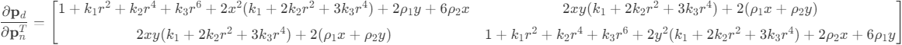
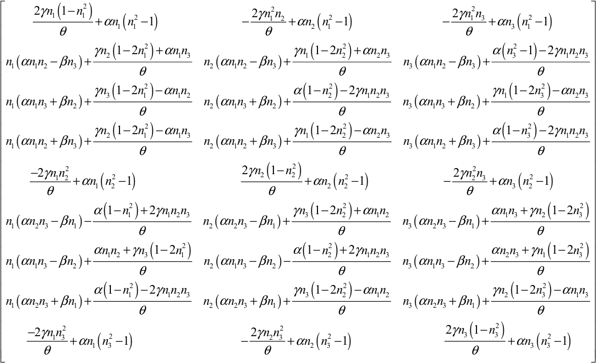
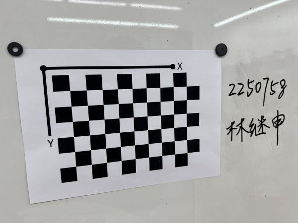
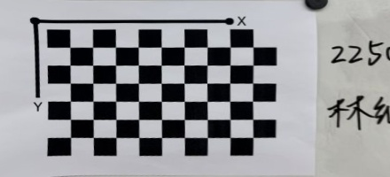

# Assignment 2

## Question 1

In the augmented Euclidean plane (which can be viewed as the projective plane), points are represented using homogeneous coordinates $(X, Y, Z)$. Lines are represented by homogeneous equations of the form $aX + bY + cZ = 0$.

Given the line $x - 3y + 4 = 0$ in the affine plane, we can convert it to its homogeneous form by introducing the homogenizing coordinate $Z$:

$$
X - 3Y + 4Z = 0
$$

### Infinity Points

Infinity points lie on the line at infinity, which is defined by $Z = 0$. To find the infinity point of the given line, substitute $Z = 0$ into the homogeneous equation:

$$
X - 3Y = 0
$$

This simplifies to:

$$
X = 3Y
$$

Therefore, the infinity point must satisfy $X = 3Y$ and $Z = 0$. By introducing a non-zero constant $k$, we can represent the homogeneous coordinates of the infinity point as:

$$
(3k, k, 0)
$$

where $k \neq 0$. Homogeneous coordinates are defined up to a scalar multiple, so any non-zero scalar $k$ will provide a valid representation of the same point in the projective plane.

### Final Answer

The homogeneous coordinates of the infinity point can be expressed as:

$$
(3k, k, 0) \quad \text{where} \quad k \neq 0
$$

## Question 2

Below is the detailed derivation of the Jacobian matrix $\frac{\partial \mathbf{p}_d}{\partial \mathbf{p}_n^T}$ from $\mathbf{p}_n=(x,y)^T$ to $\mathbf{p}_d=(x_d,y_d)^T$.

Given:

$$
x_d = x(1 + k_1 r^2 + k_2 r^4 + k_3 r^6) + 2\rho_1 x y + \rho_2(r^2 + 2x^2)
$$

$$
y_d = y(1 + k_1 r^2 + k_2 r^4 + k_3 r^6) + 2\rho_2 x y + \rho_1(r^2 + 2y^2)
$$

where $r^2 = x^2 + y^2$.

Define:

$$
A = 1 + k_1 r^2 + k_2 r^4 + k_3 r^6
$$

Thus:

$$
x_d = xA + 2\rho_1 x y + \rho_2(r^2 + 2x^2)
$$

$$
y_d = yA + 2\rho_2 x y + \rho_1(r^2 + 2y^2)
$$

We need:

$$
\frac{\partial \mathbf{p}_d}{\partial \mathbf{p}_n^T} =
\begin{bmatrix}
\frac{\partial x_d}{\partial x} & \frac{\partial x_d}{\partial y} \\[6pt]
\frac{\partial y_d}{\partial x} & \frac{\partial y_d}{\partial y}
\end{bmatrix}
$$

### Compute $\frac{\partial x_d}{\partial x}$

$$
\frac{\partial A}{\partial x} = 2x(k_1 + 2k_2 r^2 + 3k_3 r^4)
$$

$$
\frac{\partial x_d}{\partial x} = A + x\frac{\partial A}{\partial x} + 2\rho_1 y + \frac{\partial}{\partial x}[\rho_2(r^2 + 2x^2)] = A + 2x^2(k_1 + 2k_2 r^2 + 3k_3 r^4) + 2\rho_1 y + 6\rho_2 x
$$

Substitute $A$:

$$
\frac{\partial x_d}{\partial x} = (1 + k_1 r^2 + k_2 r^4 + k_3 r^6) + 2x^2(k_1 + 2k_2 r^2 + 3k_3 r^4) + 2\rho_1 y + 6\rho_2 x
$$

### Compute $\frac{\partial x_d}{\partial y}$

$$
\frac{\partial A}{\partial y} = 2y(k_1 + 2k_2 r^2 + 3k_3 r^4)
$$

$$
\frac{\partial x_d}{\partial y} = x\frac{\partial A}{\partial y} + 2\rho_1 x + \frac{\partial}{\partial y}[\rho_2(r^2 + 2x^2)] = 2xy(k_1 + 2k_2 r^2 + 3k_3 r^4) + 2\rho_1 x + 2\rho_2 y
$$

### Compute $\frac{\partial y_d}{\partial x}$

$$
\frac{\partial y_d}{\partial x} = y\frac{\partial A}{\partial x} + 2\rho_2 y + \rho_1(2x) = 2xy(k_1 + 2k_2 r^2 + 3k_3 r^4) + 2\rho_2 y + 2\rho_1 x
$$

### Compute $\frac{\partial y_d}{\partial y}$

$$
\frac{\partial y_d}{\partial y} = A + y\frac{\partial A}{\partial y} + 2\rho_2 x + \rho_1(2y + 4y) = A + 2y^2(k_1 + 2k_2 r^2 + 3k_3 r^4) + 2\rho_2 x + 6\rho_1 y
$$

Substitute $A$:

$$
\frac{\partial y_d}{\partial y} = (1 + k_1 r^2 + k_2 r^4 + k_3 r^6) + 2y^2(k_1 + 2k_2 r^2 + 3k_3 r^4) + 2\rho_2 x + 6\rho_1 y
$$

### Final Jacobian

## Question 3

### Rodrigues' Rotation Formula

Given the axis-angle representation $ d = \theta n $, the rotation matrix $ R $ can be expressed using Rodrigues' formula:

$$
R = \cos\theta I + (1 - \cos\theta) nn^T + \sin\theta \, n^\wedge
$$

where:
- $ I $ is the $ 3 \times 3 $ identity matrix.
- $ n^\wedge $ is the skew-symmetric matrix of $ n $:

  $$
  n^\wedge = \begin{bmatrix}
  0 & -n_3 & n_2 \\
  n_3 & 0 & -n_1 \\
  -n_2 & n_1 & 0
  \end{bmatrix}
  $$

- $ \alpha = \sin\theta $
- $ \beta = \cos\theta $
- $ \gamma = 1 - \cos\theta $

Substituting these notations, the rotation matrix becomes:

$$
R = \beta I + \gamma nn^T + \alpha n^\wedge
$$

### Vectorizing the Rotation Matrix

The rotation matrix $ R $ is a $ 3 \times 3 $ matrix. To facilitate differentiation, we vectorize $ R $ into a $ 9 \times 1 $ vector $ r $ in row-major order:

$$
r = \begin{bmatrix}
r_{11} & r_{12} & r_{13} & r_{21} & r_{22} & r_{23} & r_{31} & r_{32} & r_{33}
\end{bmatrix}^T
$$

### Detailed Calculation of $ r $

Expanding $ R $ using Rodrigues' formula:

$$
R = \beta I + \gamma nn^T + \alpha n^\wedge
$$

Breaking it down element-wise:

$$
R = \begin{bmatrix}
\beta + \gamma n_1^2 & \gamma n_1 n_2 - \alpha n_3 & \gamma n_1 n_3 + \alpha n_2 \\
\gamma n_2 n_1 + \alpha n_3 & \beta + \gamma n_2^2 & \gamma n_2 n_3 - \alpha n_1 \\
\gamma n_3 n_1 - \alpha n_2 & \gamma n_3 n_2 + \alpha n_1 & \beta + \gamma n_3^2
\end{bmatrix}
$$

Vectorizing $ R $:

$$
r = \begin{bmatrix}
\beta + \gamma n_1^2 \\
\gamma n_1 n_2 - \alpha n_3 \\
\gamma n_1 n_3 + \alpha n_2 \\
\gamma n_2 n_1 + \alpha n_3 \\
\beta + \gamma n_2^2 \\
\gamma n_2 n_3 - \alpha n_1 \\
\gamma n_3 n_1 - \alpha n_2 \\
\gamma n_3 n_2 + \alpha n_1 \\
\beta + \gamma n_3^2
\end{bmatrix}
$$

### Computing the Jacobian $ \frac{dr}{dn^T} $

The Jacobian matrix $ \frac{dr}{dn^T} $ is a $ 9 \times 3 $ matrix where each element $ \frac{\partial r_i}{\partial n_j} $ represents the partial derivative of the $ i $-th component of $ r $ with respect to the $ j $-th component of $ n $.

#### Partial Derivatives

Let's compute the partial derivatives for each component of $ r $:

1. **First Component $ r_1 = \beta + \gamma n_1^2 $**

   $$
   \frac{\partial r_1}{\partial n} = \begin{bmatrix}
   2\gamma n_1 \\
   0 \\
   0
   \end{bmatrix}
   $$

2. **Second Component $ r_2 = \gamma n_1 n_2 - \alpha n_3 $**

   $$
   \frac{\partial r_2}{\partial n} = \begin{bmatrix}
   \gamma n_2 \\
   \gamma n_1 \\
   -\alpha
   \end{bmatrix}
   $$

3. **Third Component $ r_3 = \gamma n_1 n_3 + \alpha n_2 $**

   $$
   \frac{\partial r_3}{\partial n} = \begin{bmatrix}
   \gamma n_3 \\
   \alpha \\
   \gamma n_1
   \end{bmatrix}
   $$

4. **Fourth Component $ r_4 = \gamma n_2 n_1 + \alpha n_3 $**

   $$
   \frac{\partial r_4}{\partial n} = \begin{bmatrix}
   \gamma n_2 \\
   \gamma n_1 \\
   \alpha
   \end{bmatrix}
   $$

5. **Fifth Component $ r_5 = \beta + \gamma n_2^2 $**

   $$
   \frac{\partial r_5}{\partial n} = \begin{bmatrix}
   0 \\
   2\gamma n_2 \\
   0
   \end{bmatrix}
   $$

6. **Sixth Component $ r_6 = \gamma n_2 n_3 - \alpha n_1 $**

   $$
   \frac{\partial r_6}{\partial n} = \begin{bmatrix}
   -\alpha \\
   \gamma n_3 \\
   \gamma n_2
   \end{bmatrix}
   $$

7. **Seventh Component $ r_7 = \gamma n_3 n_1 - \alpha n_2 $**

   $$
   \frac{\partial r_7}{\partial n} = \begin{bmatrix}
   \gamma n_3 \\
   -\alpha \\
   \gamma n_1
   \end{bmatrix}
   $$

8. **Eighth Component $ r_8 = \gamma n_3 n_2 + \alpha n_1 $**

   $$
   \frac{\partial r_8}{\partial n} = \begin{bmatrix}
   \alpha \\
   \gamma n_3 \\
   \gamma n_2
   \end{bmatrix}
   $$

9. **Ninth Component $ r_9 = \beta + \gamma n_3^2 $**

   $$
   \frac{\partial r_9}{\partial n} = \begin{bmatrix}
   0 \\
   0 \\
   2\gamma n_3
   \end{bmatrix}
   $$

#### Assembling the Jacobian Matrix

Combining all the partial derivatives, the Jacobian matrix $ \frac{dr}{dn^T} $ is:

$$
\frac{dr}{dn^T} =
\begin{bmatrix}
2\gamma n_1 & 0 & 0 \\
\gamma n_2 & \gamma n_1 & -\alpha \\
\gamma n_3 & \alpha & \gamma n_1 \\
\gamma n_2 & \gamma n_1 & \alpha \\
0 & 2\gamma n_2 & 0 \\
-\alpha & \gamma n_3 & \gamma n_2 \\
\gamma n_3 & -\alpha & \gamma n_1 \\
\alpha & \gamma n_3 & \gamma n_2 \\
0 & 0 & 2\gamma n_3 \\
\end{bmatrix}
$$

### Calculate the Jacobian Matrix of $ r $ with Respect to $ d $ ($ \frac{\partial r}{\partial d^T} $)

According to the chain rule:

$$
\frac{\partial r}{\partial d^T} = \frac{\partial r}{\partial \theta} \frac{\partial \theta}{\partial d^T} + \frac{\partial r}{\partial n^T} \frac{\partial n}{\partial d^T}
$$

1. **Calculate $\frac{\partial \theta}{\partial d^T}$:**

   Since $\theta = \|d\| = \sqrt{d_1^2 + d_2^2 + d_3^2}$,

   $$
   \frac{\partial \theta}{\partial d^T} = \frac{d^T}{\theta} = n^T
   $$

2. **Calculate $\frac{\partial n}{\partial d^T}$:**

   Given $ n = \frac{d}{\theta} $, we differentiate with respect to $ d^T $:

   $$
   \frac{\partial n}{\partial d^T} = \frac{\partial}{\partial d^T}\left(\frac{d}{\theta}\right)
   = \frac{1}{\theta} I - \frac{1}{\theta} nn^T
   $$

   Here, we used the product rule and the fact that $ \frac{\partial \theta}{\partial d^T} = n^T $.

   Thus:

   $$
   \frac{\partial n}{\partial d^T} = \frac{1}{\theta}(I - nn^T)
   $$

3. **Substitute into the Chain Rule:**

   Plugging the above results back into the chain rule:

   $$
   \frac{\partial r}{\partial d^T} = \left( \frac{\partial r}{\partial \theta} n^T \right) + \frac{1}{\theta}\left( \frac{\partial r}{\partial n^T} - \frac{\partial r}{\partial n^T} nn^T \right)
   $$

### Final Answer

The concrete form of the Jacobian matrix is:

## Question 4

### Intrinsic Parameters

#### Intrinsic Matrix

$$
\mathbf{K} = \begin{bmatrix}
430.01633373 & 0 & 302.20126115 \\[6pt]
0 & 430.77183097 & 228.09921438 \\[6pt]
0 & 0 & 1
\end{bmatrix}
$$

#### Distortion Coefficients

$$
\text{dist} = [\,0.17789645,\;0.0098844,\;0.00226253,\;0.00449258,\;-1.80532813\,]
$$

#### Rotation Vectors

$$
r_1 = \begin{bmatrix}-0.14512346 \\ 0.3869763 \\ -1.52246141 \end{bmatrix}, \quad
r_2 = \begin{bmatrix}1.95943633\times10^{-4} \\ 0.564179123 \\ -1.44322076 \end{bmatrix}, \quad
$$

$$
r_3 = \begin{bmatrix}-0.2035875 \\ 0.60022436 \\ -1.40998639 \end{bmatrix}, \quad
r_4 = \begin{bmatrix}0.30757401 \\ -0.08128856 \\ -1.60972509 \end{bmatrix}, \quad
$$

$$
r_5 = \begin{bmatrix}0.04464187 \\ -0.40286626 \\ -1.56727629 \end{bmatrix}, \quad
r_6 = \begin{bmatrix}-0.15962519 \\ -0.09522919 \\ -1.55060178 \end{bmatrix}, \quad
$$

$$
r_7 = \begin{bmatrix}0.33985758 \\ 0.2701092 \\ -1.61652252 \end{bmatrix}, \quad
r_8 = \begin{bmatrix}0.17408326 \\ 0.37330554 \\ -1.56109978 \end{bmatrix}, \quad
$$

$$
r_9 = \begin{bmatrix}0.38518354 \\ -0.25307185 \\ -1.65079908 \end{bmatrix}, \quad
r_{10} = \begin{bmatrix}0.0338633 \\ 0.10335341 \\ -1.56697592 \end{bmatrix} \quad
$$

#### Translation Vectors

$$
t_1 = \begin{bmatrix}-0.17165938 \\ 0.04824711 \\ 0.38153825 \end{bmatrix}, \quad
t_2 = \begin{bmatrix}-0.16042552 \\ 0.06473332 \\ 0.38600684 \end{bmatrix}, \quad
$$

$$
t_3 = \begin{bmatrix}-0.17510715 \\ 0.04026279 \\ 0.40044244 \end{bmatrix}, \quad
t_4 = \begin{bmatrix}-0.09885636 \\ 0.07053844 \\ 0.29029036 \end{bmatrix}, \quad
$$

$$
t_5 = \begin{bmatrix}-0.09230195 \\ 0.04077469 \\ 0.28643277 \end{bmatrix}, \quad
t_6 = \begin{bmatrix}-0.13576589 \\ 0.0337721 \\ 0.30513944 \end{bmatrix}, \quad
$$

$$
t_7 = \begin{bmatrix}-0.11195091 \\ 0.09106429 \\ 0.38893098 \end{bmatrix}, \quad
t_8 = \begin{bmatrix}-0.14017043 \\ 0.10319185 \\ 0.37664702 \end{bmatrix}, \quad
$$

$$
t_9 = \begin{bmatrix}-0.05937183 \\ 0.06988249 \\ 0.28830133 \end{bmatrix}, \quad
t_{10} = \begin{bmatrix}-0.13730313 \\ 0.06309937 \\ 0.3334238 \end{bmatrix} \quad
$$

### Original Image

### Bird's Eye View Image

