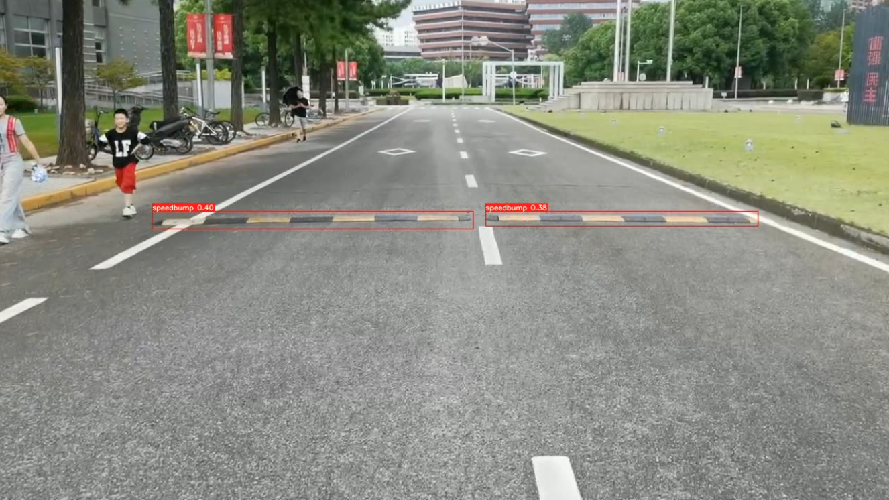

# Assignment 3

## Question 1

Given the problem:

$$
L(h) = \frac{1}{2} (f(x+h))^{T} f(x+h) + \frac{1}{2} \mu h^{T} h
$$

$$
= \frac{1}{2} (f(x))^{T} f(x)+h^{T} (J(x))^{T} f(x) + \frac{1}{2} h^{T} (J(x))^{T} J(x) h + \frac{1}{2} \mu h^{T} h
$$

First, compute the gradient of $L(h)$ with respect to $h$:

$$
\nabla L(h) = (J(x))^{T}f(x) + (J(x))^{T}J(x)h + \mu h
$$

Next, compute the Hessian matrix by taking the derivative of $\nabla L(h)$ with respect to $h$:

$$
\nabla^{2} L(h) = (J(x))^{T}J(x) + \mu I
$$

where $I$ is the identity matrix.

To prove that the Hessian matrix is positive definite, we need to show that for any non-zero vector $v \in \mathbb{R}^{n}$, $v^T\nabla^{2} L(h)v > 0$.

$$
v^T\nabla^{2} L(h)v = v^T((J(x))^{T}J(x) + \mu I)v = v^T(J(x))^{T}J(x)v + \mu v^T v
$$

Since $\mu > 0$ and $v^T v > 0$, it suffices to prove that $v^T(J(x))^{T}J(x)v \geq 0$.

$$
v^T(J(x))^{T}J(x)v = (J(x)v)^{T}(J(x)v) \geq 0
$$

Therefore, $v^T\nabla^{2} L(h)v = v^T(J(x))^{T}J(x)v + \mu v^T v > 0$, which implies that the Hessian matrix is positive definite. Hence, $L(h)$ is a strictly convex function.

## Question 2

I have trained a speed bump detection model using YOLOv8. The prediction video is available in `PredictionVideo.mp4`, and a sample frame from the video is displayed below.

## Question 3

I utilized the handheld 3D surface scanning system, Creaform Go Scan 3D, to capture a three-dimensional facial model. The acquired data was then processed using Blender, a comprehensive 3D editing software. The original facial model is stored in the file `OriginalModel.obj`, while the refined facial model can be found in `ProcessedModel.stl` . For detailed insights and findings, please refer to the experimental report contained within `ExperimentalReport.pdf` .