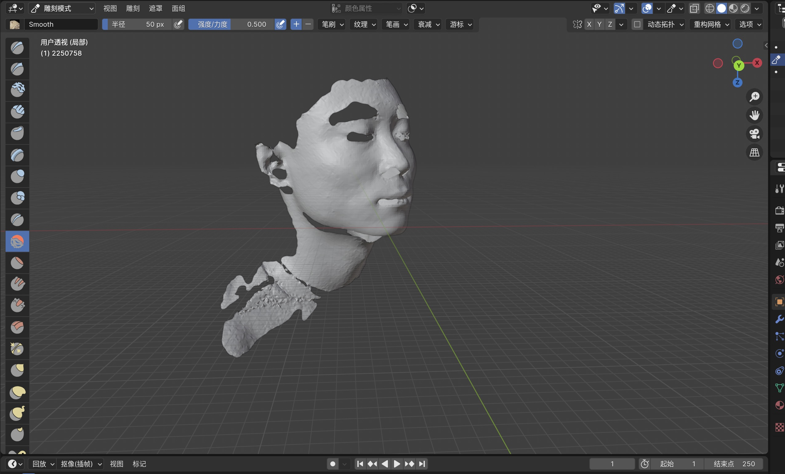

# Experimental Report

**Name**: Jishen Lin

**Student ID**: 2250758

## Experiment Name

3D Model Scanning and Data Processing

## Experiment Objectives

1. Understand the representation forms and storage formats of 3D model data;
2. Master the usage of the handheld 3D surface scanning system, Creaform Go Scan 3D, including both hardware and software;
3. Learn the operation of common geometric editing software (e.g., GeoMagic Studio) and be able to perform basic editing on raw 3D scan data.

## Experiment Equipment

* **Hardware**: Creaform Go Scan 3D 3D Scanner
* **Software**: Creaform Go Scan 3D accompanying scanning software, **Blender**

## Experiment Content

Students will pair up and use the Creaform Go Scan 3D scanning device to capture an initial facial model of their partner. After obtaining the initial model, students will need to refine their own facial model to achieve a more detailed and polished result.

### 3D Scanner Data Acquisition Process

The acquisition process is as follows. Please refer to the experimental guide for operation:

#### Creaform Go Scan 3D 3D Scanner

This 3D scanning device is based on structured light technology and is a portable scanning device. The device is connected to a computer via a USB interface to complete data acquisition. Its appearance is shown in the figure below.

Before starting the scan, check the following:

* The scanner’s USB cable is connected to the computer;
* The scanner’s power cable is properly connected;
* The accompanying scanning software, VXelements, is open, as shown in the figure below;
* If the subject being scanned is a person, ensure their eyes are tightly closed, as the white light emitted by the scanner is bright and potentially harsh.

During the scanning process, pay close attention to the color changes of the scanner’s indicator light:

* **Green**: Indicates normal operation;
* **Front red light on**: Indicates the operating distance is too close;
* **Rear red light on**: Indicates the operating distance is too far.
Adjust the operating distance based on the indicator light to ensure scanning quality.

#### VXelements 3D Scanning Software

This software is the accompanying data acquisition software for the Go Scan 3D scanner. It is simple to use, and its default settings are suitable for most scenarios.

* Scanning starts and ends by clicking the "Scan" button.
* Once the scan is complete, save the scanned data promptly. The data format can be selected based on the requirements of the subsequent geometric processing software.

After the data scanning is completed, it needs to be saved promptly.

### Geometric Data Post-Processing

The raw geometric data obtained from the Go Scan 3D scanner inevitably contains noise, holes, and other imperfections. To achieve a more desirable result, further refinement is required using Blender, a geometric data processing software. Below are the detailed steps:

#### Import the Original OBJ File

1. Open Blender. By default, the scene contains a cube object, which can be deleted by pressing `X`.
2. Click on the menu bar **File** → **Import** → **Wavefront (.obj)**, and select the original OBJ file exported from the Go Scan 3D scanner.
3. After importing, the model will appear in the 3D view. You can zoom in/out using the mouse wheel and rotate the view by holding the middle mouse button to inspect the model.

#### Enter Edit Mode for Repair

1. Select the model and press `Tab` to enter **Edit Mode**.
2. In the left toolbar, choose the **Select Tool** to select areas with holes or noise on the model.
3. Press `M` to open the **Merge Menu** and select **By Distance** to remove duplicate vertices.
4. For larger holes, use the **Face Fill Tool**: select the vertices around the hole and press `F` to fill the face.
5. For smaller noise, use the **Smooth Tool**: select the area to be smoothed, press `Ctrl + F` to open the face menu, and choose **Smooth Vertices**.

#### Use Sculpt Mode for Smoothing

1. Press `Tab` to return to **Object Mode**.
2. Switch to **Sculpt Mode** in the right toolbar.
3. Select the **Smooth Brush**, adjust the brush size (press `F`) and strength, and apply it to the model’s surface to smooth out uneven areas.
4. For finer adjustments, use the **Elastic Deform Brush** or **Pinch Brush** to refine the model details.

#### Hide Unnecessary Parts

1. Return to **Edit Mode** and select parts of the model that are not needed (e.g., hair, background).
2. Press `H` to hide the selected parts or press `X` to delete them.
3. To restore hidden parts, press `Alt + H`.

#### Check the Final Result

1. In **Object Mode**, press `Z` to switch between view modes and inspect the model’s wireframe and surface.
2. Ensure the model’s surface is smooth, holes are repaired, noise is removed, and the overall result meets expectations.

#### Export the STL File

The STL (StereoLithography) file format is widely used in the fields of 3D printing and computer-aided design (CAD). It is employed to represent the surface geometry of three-dimensional models and is one of the most commonly used file formats in 3D printing.

1. Click on the menu bar **File** → **Export** → **STL (.stl)**.
2. In the dialog box, choose the save path and name the file, then click **Export STL**.
3. The exported STL file can be used for 3D printing or further processing.

Through the above steps, we used Blender to repair and refine the raw facial model obtained from the Go Scan 3D scanner. This included importing the OBJ file, repairing in Edit Mode, smoothing in Sculpt Mode, hiding unnecessary parts, and exporting the STL file.

## Experiment Summary

Through this experiment, I successfully acquired an initial facial model using the Creaform Go Scan 3D scanner and refined the model using Blender software. During the experiment, I mastered the basic operational workflow of the 3D scanner and learned how to process geometric data through edit mode and sculpt mode, ultimately exporting a high-quality STL file. The final 3D facial model obtained has complete and clear facial features, with no significant holes, flat areas, or other defects. This experiment not only deepened my understanding of 3D model data processing but also laid a solid foundation for subsequent applications.