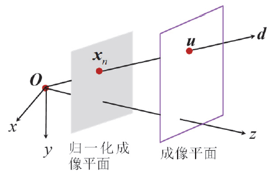
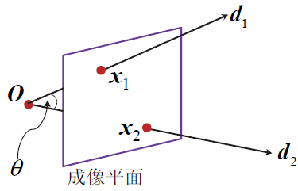

# Qusetion 6

Vanishing points. $I_1$ and $I_2$ are two world lines perpendicular to each other on the same plane, and $\mathbf{v}_1$ and $\mathbf{v}_2$ are their vanishing points on the imaging plane, respectively. Please prove that $\mathbf{v}_1^T(\mathbf{K}^{-T}\mathbf{K}^{-1}) \mathbf{v}_2 = 0$ where $\mathbf{K}$ is the intrinsic matrix of the pinhole camera.

消失点。 $I_1$ 和 $I_2$ 是同一平面上互相垂直的两条世界线， $\mathbf{v}_1$ 和 $\mathbf{v}_2$ 分别是它们在成像平面上的消失点。请证明 $\mathbf{v}_1^T(\mathbf{K}^{-T}\mathbf{K}^{-1}) \mathbf{v}_2 = 0$ ，其中 $\mathbf{K}$ 是针孔相机的内参矩阵。

## Answer

**引理 1**：设相机光心为 $O$ ， $u$ 为成像平面像素坐标系下一点的齐次坐标表示，则在相机坐标系下，射线 $\overrightarrow{Ou}$ 的方向 $d$ 可表示为 $d = K^{-1}u$ ，其中 $K$ 为相机内参矩阵。

**证明 1**：设像素 $u$ 的规范化齐次坐标表达为 $u'$ ，则 $u'$ 与归一化成像平面上的对应点 $p_n = (x_n, y_n, 1)^T$ 之间的关系为 $p_n = K^{-1}u'$ 。 $(x_n, y_n, 1)^T$ 恰好也是 $p_n$ 这个点在相机坐标系下的三维空间坐标。同时，根据相机成像模型知道， $O$ 、 $p_n$ 、 $u$ 三点共线，因此 $d$ 可以表达为 $d = \overrightarrow{Ou} = \overrightarrow{Op_n} = p_n = K^{-1}u'$ 。

显然 $\forall c \neq 0$ ， $cK^{-1}u' = K^{-1}(cu')$ 都可以用来表示方向 $d$ ，而 $cu'$ 就是 $u'$ 的普通齐次坐标表示，即为 $u$ 。因此， $d = K^{-1}u$ 。

**引理 2**：设相机光心为 $O$ ， $x_1$ 和 $x_2$ 为成像平面像素坐标系下两点的齐次坐标，则在相机坐标系下，射线 $\overrightarrow{Ox_1}$ 与 $\overrightarrow{Ox_2}$ 的夹角 $\theta$ 为：

$$
\theta = \arccos\left(\frac{x_{1}^{T}\left(K^{-T}K^{-1}\right)x_{2}}{\sqrt{x_{1}^{T} \left(K^{-T}K^{-1}\right)x_{1}} \sqrt{x_{2}^{T}\left(K^{-T}K^{-1}\right)x_{2}}}\right)
$$

其中 $K$ 为相机内参矩阵。

**证明 2**：设 $\overrightarrow{Ox_1}$ 的方向为 $d_1$ ， $\overrightarrow{Ox_2}$ 的方向为 $d_2$ 。根据引理 1 可知， $d_1 = K^{-1}x_1$ ， $d_2 = K^{-1}x_2$ ，因此有：

$$
\cos\theta = \frac{d_1 \cdot d_2}{\|d_1\| \|d_2\|} = \frac{(K^{-1}X_1)^T K^{-1}X_2}{\sqrt{(K^{-1}X_1)^T (K^{-1}X_1)} \sqrt{(K^{-1}X_2)^T (K^{-1}X_2)}} = \frac{x_1^T (K^{-T}K^{-1}) x_2}{\sqrt{x_1^T (K^{-T}K^{-1}) x_1} \sqrt{x_2^T (K^{-T}K^{-1}) x_2}}
$$

于是：

$$
\theta = \arccos\left(\frac{x_1^T (K^{-T}K^{-1}) x_2}{\sqrt{x_1^T (K^{-T}K^{-1}) x_1} \sqrt{x_2^T (K^{-T}K^{-1}) x_2}}\right)
$$

**证明**：由于 $v_1$ 和 $v_2$ 是空间直线 $l_1$ 和 $l_2$ 在成像平面上的消失点，因为如果相机光心为 $O$ ， $v$ 为成像平面上一点，则直线 $Ov$ 平行于空间中以 $v$ 为消失点的直线，所以 $l_1 \parallel \overrightarrow{Ov_1}$ ， $l_2 \parallel \overrightarrow{Ov_2}$ ，又由于 $l_1 \perp l_2$ ，所以 $\overrightarrow{Ov_1} \perp \overrightarrow{Ov_2}$ ，即 $\overrightarrow{Ov_1}$ 和 $\overrightarrow{Ov_2}$ 之间的夹角 $\theta = \frac{\pi}{2}$ ，由引理 2 可知：

$$
\cos\theta = \frac{v_{1}^{T}\left(K^{-T}K^{-1}\right)v_{2}}{\sqrt{v_{1}^{T} \left(K^{-T}K^{-1}\right)v_{1}} \sqrt{v_{2}^{T}\left(K^{-T}K^{-1}\right)v_{2}}} = \cos\frac{\pi}{2} = 0
$$

所以 $\mathbf{v}_1^T(\mathbf{K}^{-T}\mathbf{K}^{-1}) \mathbf{v}_2 = 0$ 。