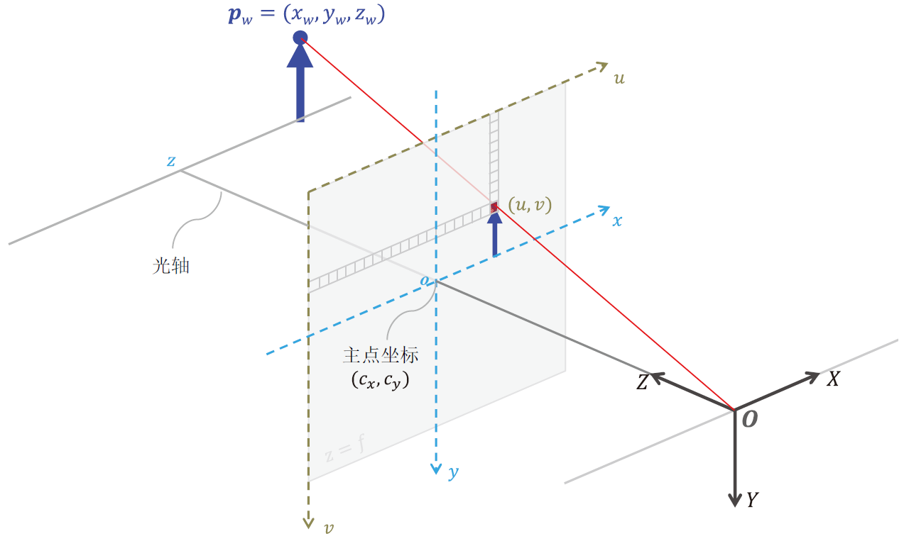

# Question 7

Imaging model of the camera. For many machine vision applications, we need to model the process of imaging, i.g., how a point in the 3D world space is mapped to a pixel on an image. The pinhole model is widely used to model such a process as depicted in the following figure.

相机的成像模型。在许多机器视觉应用中，我们需要对成像过程进行建模，即如何将三维世界空间中的一个点映射到图像上的一个像素。针孔模型被广泛用于模拟这一过程，如下图所示。

Please present in details how a 3D point $(X, Y, Z)^T$ in the world coordinate system is mapped to a pixel $(u, v)^T$ on the image.

请详细说明世界坐标系中的三维点 $(X, Y, Z)^T$ 是如何映射到图像上的像素 $(u, v)$ 的。

## Answer